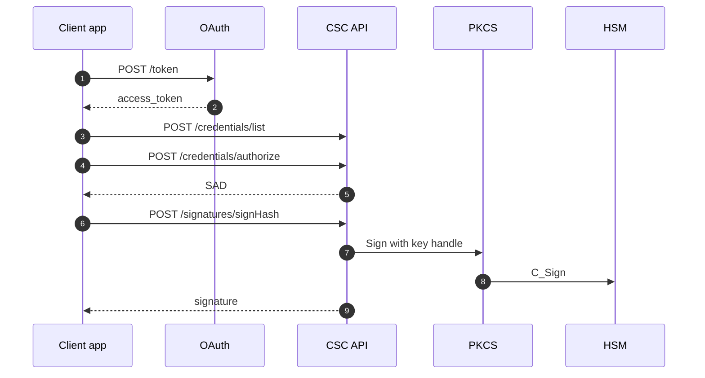

# CSC Remote Signing Service — project documentation

> Portfolio sample for **Cloud Signature Consortium** style remote signing.

## Overview

Standards-based API so clients send **hashes** only; signatures are created in **HSM** behind a CSC service. This folder contains the **contract**, **demo payloads**, and links to a **Spring mock server**.

## Architecture diagram



## Complex use case

**Scenario:** Mobile app signs loan PDF — keys never on device.

**Flow:** OAuth → list credentials → authorize (SAD) → signHash → optional timestamp.

Full narrative: [docs/use-cases/01-csc-remote-signing.md](../docs/use-cases/01-csc-remote-signing.md)

## Repository layout (this project)

| Folder / file | Purpose |
|---------------|---------|
| [openapi.yaml](./openapi.yaml) | OpenAPI 3 contract |
| [demo/](./demo/) | curl steps, JSON samples, Postman collection |
| [../csc-mock-server/](../csc-mock-server/) | **Runnable Spring Boot** mock (`localhost:8081`) |

## Quick start (mock server)

```bash
# Terminal 1
cd ../csc-mock-server && mvn spring-boot:run

# Terminal 2
cd demo && powershell -File run-against-mock.ps1
```

## API endpoints

| Method | Path |
|--------|------|
| GET | `/info` |
| POST | `/oauth2/token` |
| POST | `/credentials/list` |
| POST | `/credentials/authorize` |
| POST | `/signatures/signHash` |
| POST | `/timestamps` |
