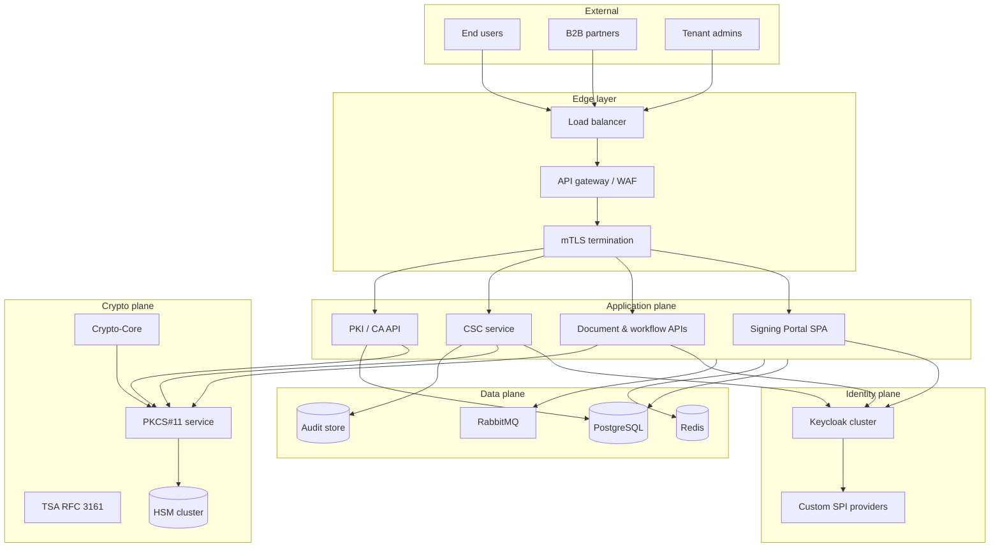

# Platform overview

High-level view of a **digital trust platform**: IAM, CSC remote signing, PKI, and HSM crypto.

## Planes explained

| Plane | Responsibility |
|-------|----------------|
| Edge | TLS, rate limits, tenant routing, optional client certificates |
| Identity | OIDC tokens, realms, SPI extensions for PKI-backed users |
| Signing | Portal UX, CSC, PDF workflows, editor/field APIs, state machines |
| Crypto | HSM sessions, key handles, algorithm policy enforcement |
| PKI | Issuance, revocation, OCSP/CRL, certificate profiles |
| Data | Tenant metadata, audit, async jobs, cache |
