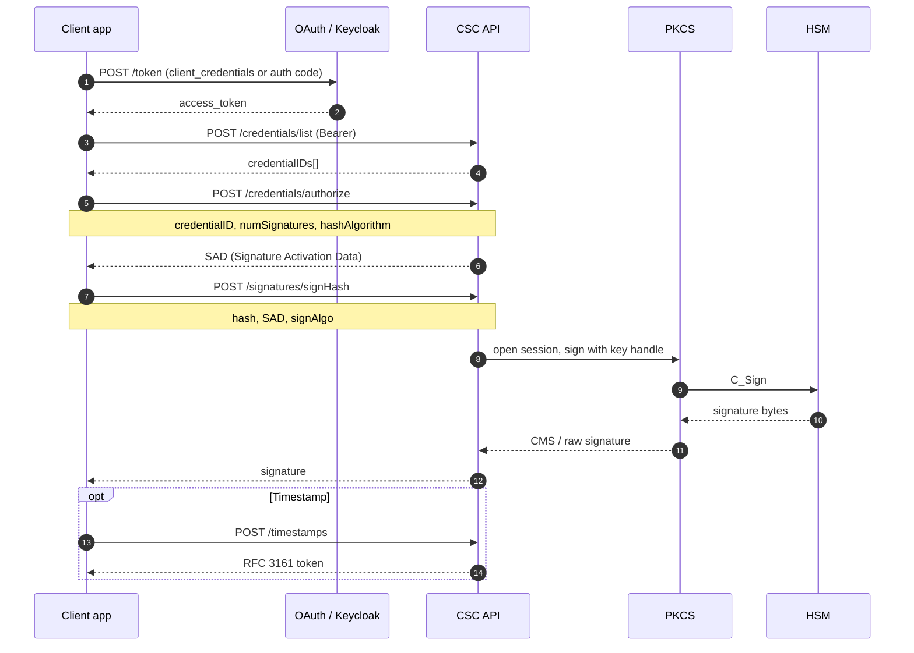

# CSC remote signing sequence

Typical **Cloud Signature Consortium** style flow: token → credential discovery → authorization → `signHash`.

## Failure modes to handle in production

| Step | Risk | Mitigation |
|------|------|------------|
| authorize | Brute force / credential stuffing | Rate limit per client_id + IP |
| SAD | Replay of activation data | Short TTL, one-time use, bind to client session |
| signHash | Algorithm downgrade | Server-side allow-list for signAlgo |
| HSM | Session exhaustion | Pool sizing, timeouts, circuit breaker |

See [use case 01](../use-cases/01-csc-remote-signing.md) and [CSC demo](../../csc-remote-signing-openapi/demo/).
