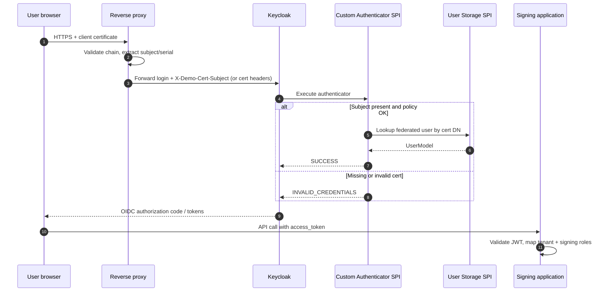

# Keycloak + PKI authentication

Certificate-terminated login with **custom SPI** bridging X.509 attributes to Keycloak sessions.

## SPI types commonly involved

| SPI | Purpose in PKI platforms |
|-----|--------------------------|
| **Authenticator** | Gate login on certificate presence/policy |
| **User Storage** | Map cert identity → Keycloak user |
| **Protocol Mapper** | Add `signing_profile`, `tenant_id` claims |
| **Event Listener** | Audit login for compliance |

Sample code: [keycloak-pki-authenticator](../../keycloak-pki-authenticator/).
