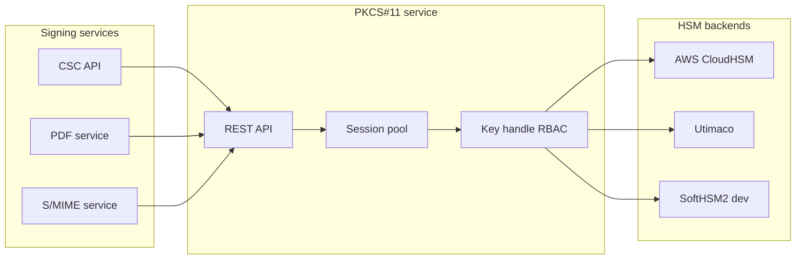
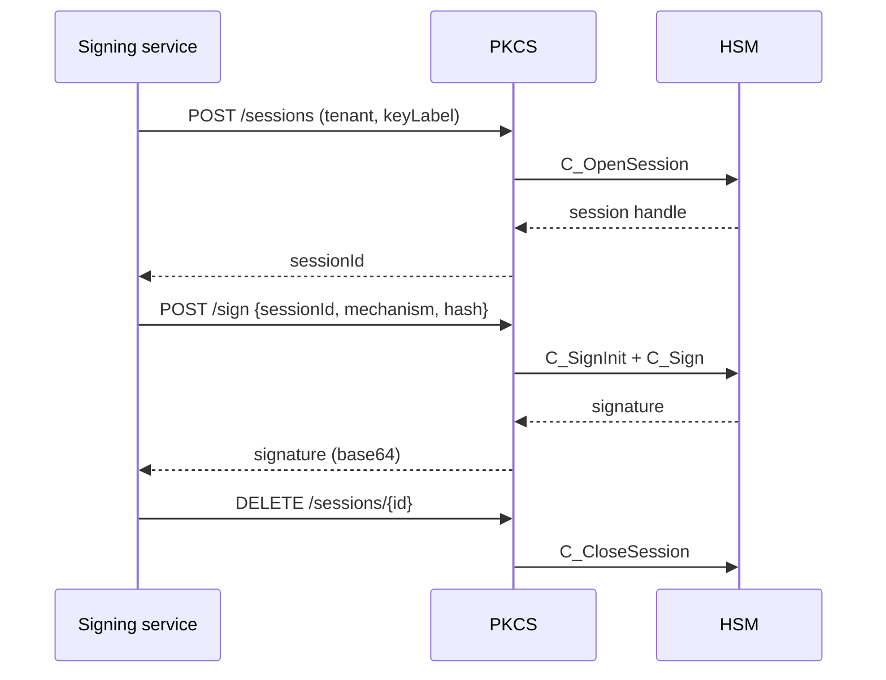

# HSM signing via PKCS#11

How signing services avoid direct HSM coupling by using a **PKCS#11 microservice**.

## Design decisions

- **Pooled sessions** reduce `C_OpenSession` latency under burst signing.
- **Per-tenant key labels** enforce isolation on shared HSM partitions.
- **Structured errors** (`HSM_TIMEOUT`, `INVALID_MECHANISM`) speed up on-call.
