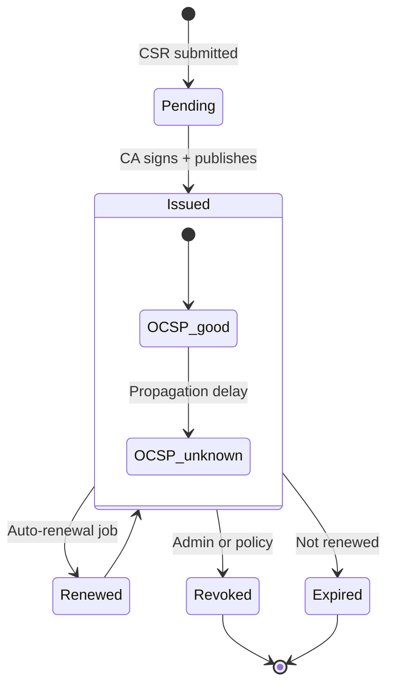
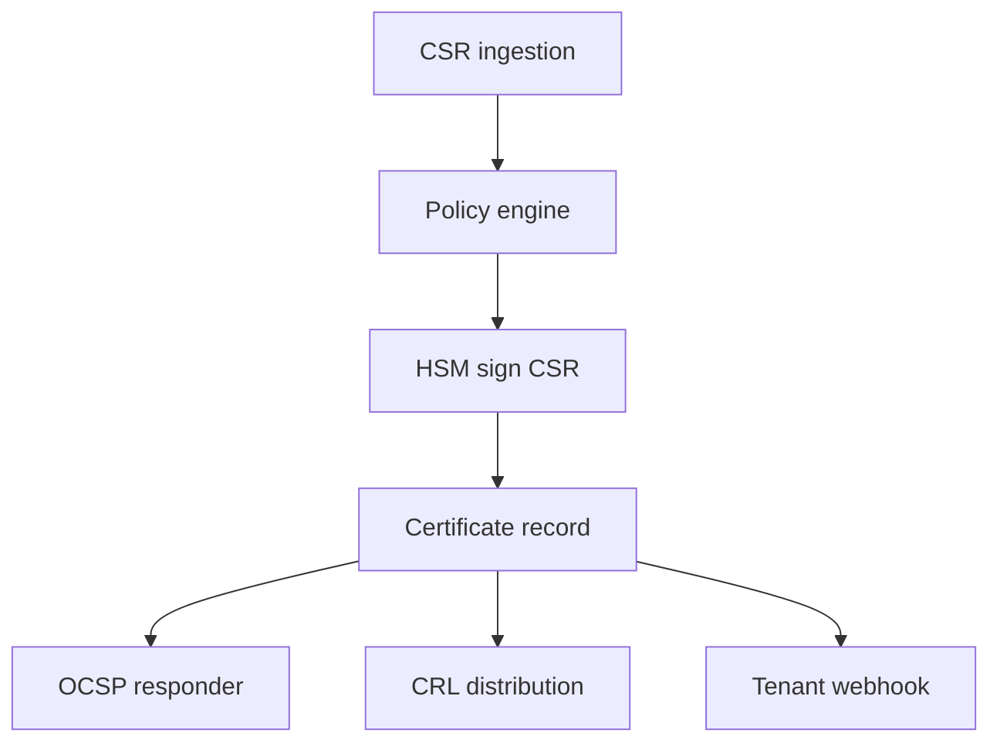

# PKI certificate lifecycle

## Operational checks

| Check | Frequency |
|-------|-----------|
| OCSP responder latency | Continuous |
| CRL freshness | Hourly |
| Renewal window (e.g. T-30 days) | Daily batch |
| HSM capacity for issuance spikes | Weekly review |
