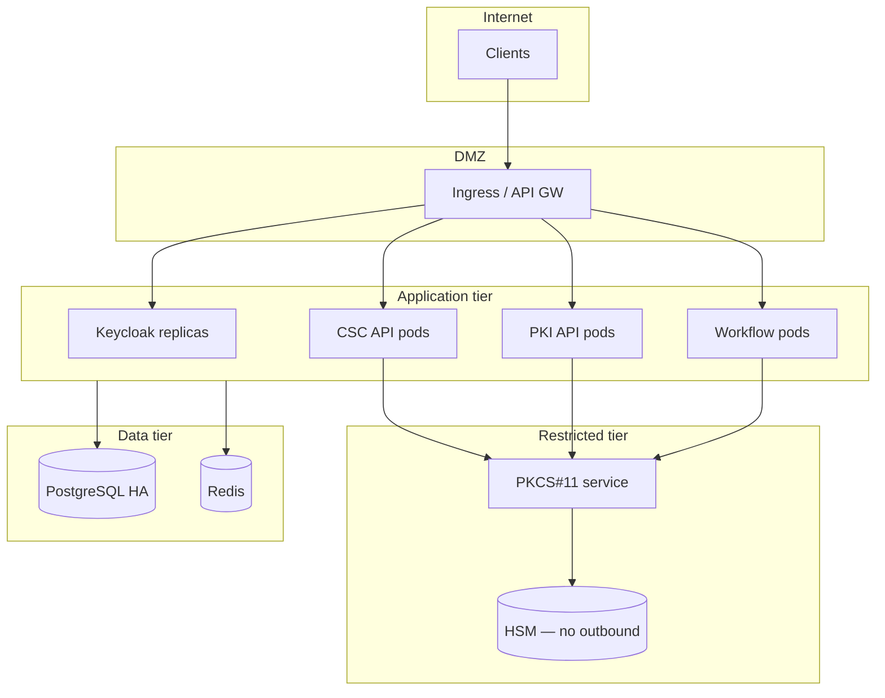

# Deployment topology

Example **production-style** layout (Kubernetes or VM-based).

## Network rules (summary)

- Crypto tier: **no** direct internet egress.
- HSM: allow only PKCS#11 service security group.
- Audit logs: ship to SIEM via sidecar / forwarder.
