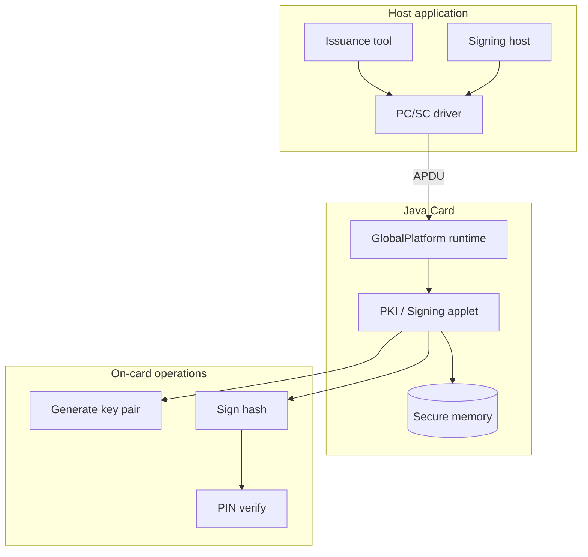
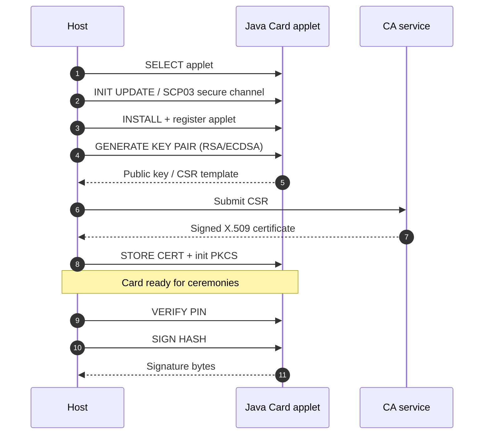
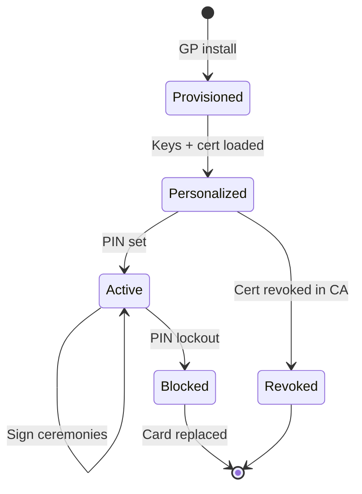

# Java Card applet lifecycle

On-card secure element: **GlobalPlatform** lifecycle, key generation, and host-driven signing ceremonies.

## Lifecycle states

## Security properties

| Property | Implementation |
|----------|----------------|
| Private key non-export | Key never leaves secure memory |
| PIN gate | Signing requires verified PIN |
| Channel security | GP SCP03 for personalization |
| Audit | Host logs APDU command + card serial |

## Related docs

- [Use case: Java Card issuance](../use-cases/05-java-card-issuance.md)
- [Platform overview](./01-platform-overview.md)
