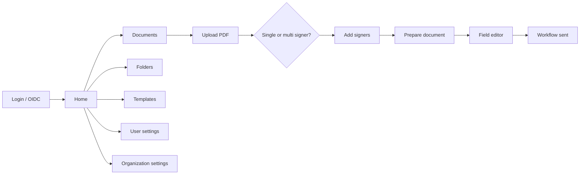
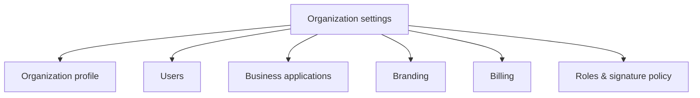
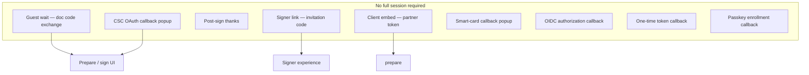
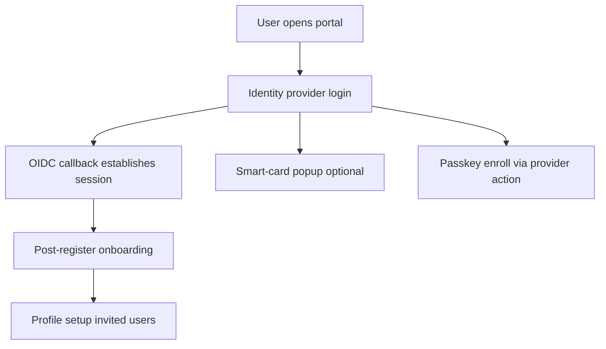
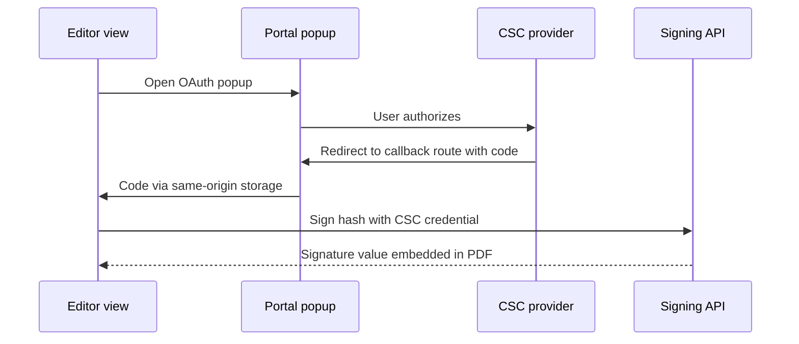
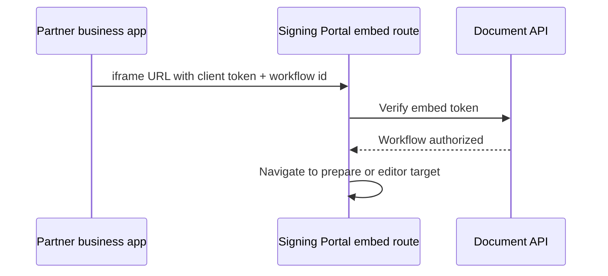

# Signing Portal — user flows

Generic routes and modules aligned with a production **document signing workspace** SPA (React, OIDC, multi-tenant RBAC). No proprietary product names.

## Authenticated application map

## Organization admin tabs (permission-gated)

## Public / low-trust routes

## Authentication methods

## CSC qualified signing in editor

## Integration embed

## Related

- [Platform overview](./01-platform-overview.md)
- [CSC sequence](./02-csc-remote-signing-sequence.md)
- [Signing platform README](../../signing-platform-architecture/README.md)
