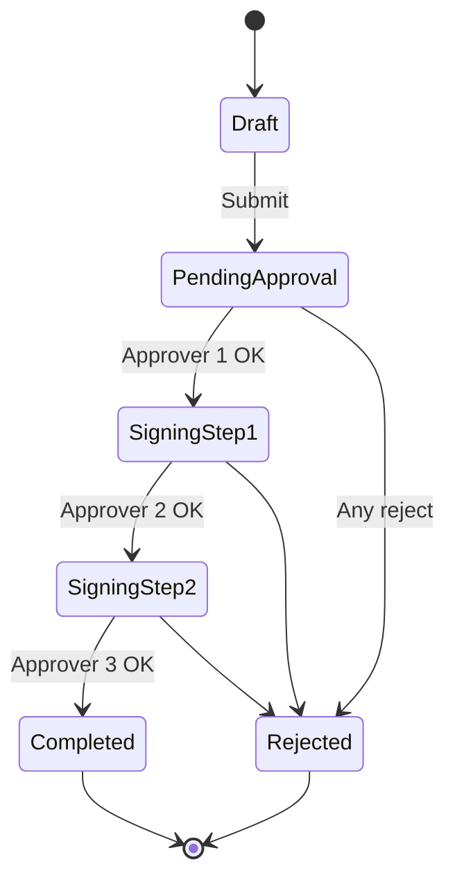

# Use case 03: PDF workflow with HSM signing

## Scenario

Legal team uploads a contract PDF. **Three approvers** must sign in order; each signature uses a certificate stored in HSM with a visible audit trail and timestamp.

## State machine

## Technical steps per signature

1. Workflow service loads PDF hash (PAdES preparation).
2. Validates approver OIDC token + role `SIGNER_L3`.
3. Calls PKCS#11 service with tenant key + `C_Sign`.
4. Embeds signature dictionary in PDF.
5. Requests TSA token and embeds timestamp.
6. Writes immutable audit row: `userId`, `certSerial`, `hash`, `tsaId`.

## Complex considerations

| Topic | Detail |
|-------|--------|
| Concurrent edits | Optimistic lock on workflow version |
| Large PDFs | Stream hash computation; do not load 200MB into heap |
| LTV | Collect OCSP/CRL for chain at signing time |
| HSM latency | Async job + webhook when signing completes |

## Related diagrams

- [HSM / PKCS#11](../diagrams/04-hsm-pkcs11-signing.md)
- [Platform overview](../diagrams/01-platform-overview.md)
