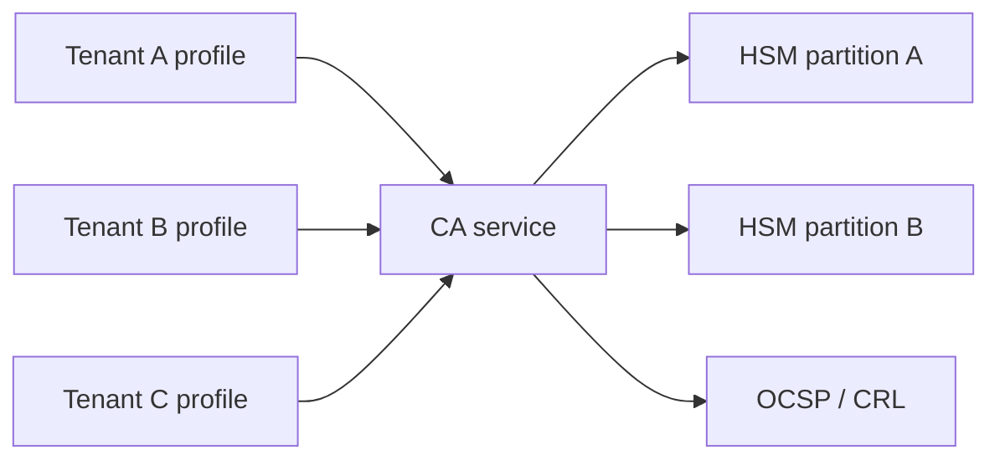

# Use case 04: Multi-tenant PKI

## Scenario

SaaS operator hosts **one CA infrastructure** with isolated profiles per tenant: different key algorithms, validity periods, and OCSP URLs.

## Tenant isolation model

| Isolation layer | Mechanism |
|-----------------|-----------|
| Data | `tenant_id` on every certificate row |
| Crypto | Separate HSM key labels per tenant |
| API | JWT claim `tenant_id` enforced in CA API |
| Revocation | OCSP responses scoped by issuer DN |

## Issuance flow

1. Tenant admin submits CSR via API (authenticated).
2. Policy engine checks: key size, EKU, max validity.
3. CA service signs CSR via PKCS#11 → HSM.
4. Publishes cert + triggers OCSP update.
5. Optional webhook to tenant SIEM.

## Complex considerations

- **Cross-tenant CSR** rejected at API gateway and policy layer.
- **Shared OCSP** must route by issuer without cache bleed.
- **Renewal batch** jobs partitioned by tenant to avoid one slow tenant blocking others.

## Diagram

[PKI lifecycle](../diagrams/05-pki-lifecycle.md)
