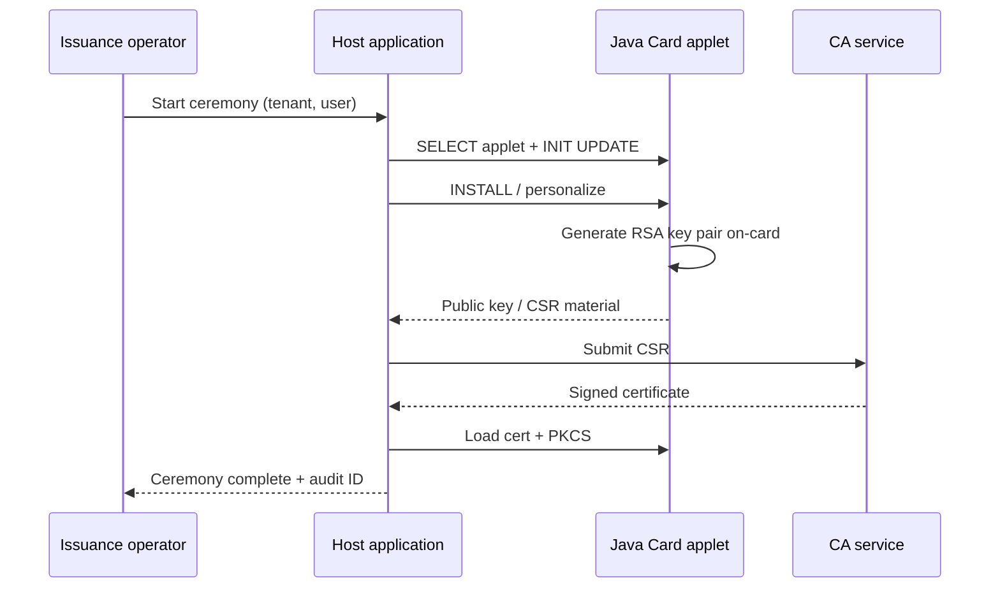

# Use case 05: Java Card issuance

## Scenario

High-assurance users receive a **smart card** with on-card key pair for signing. Host application drives **GlobalPlatform** lifecycle and PKCS#15 directory setup.

## Ceremony flow

## Applet responsibilities (typical)

| Function | On-card |
|----------|---------|
| Key generation | RSA/ECDSA key pair in secure memory |
| Sign | Small hash signing with PIN verification |
| PIN policy | Retry counter, block after N failures |

## Complex considerations

| Topic | Detail |
|-------|--------|
| GP keys | Secure channel with diversified keys per batch |
| Applet versioning | Upgrade path without bricking issued cards |
| Host drivers | PC/SC on Windows/Linux; consistent APDU logging |
| Backup keys | Policy: no export of private key — ever |

## Sample reference

- Architecture and ceremony flow in this document
- Related platform context: [Platform overview](../diagrams/01-platform-overview.md)

> Production Java Card applet source is typically proprietary; this repo documents **flows, APDU patterns, and GP lifecycle** for interviews.
