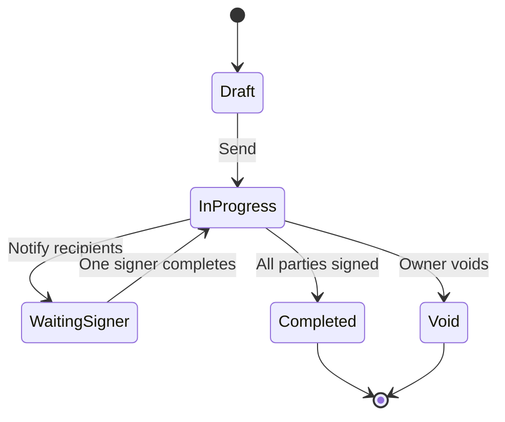

# Use case 06: Multi-tenant document signing workspace

## Scenario

A **B2B organization** uses the Signing Portal to send a contract PDF to two external signers and one internal approver. Signers without accounts receive email links; the internal user uses **advanced** signature policy; one signer uses **qualified** signing through a CSC provider.

## Actors

| Actor | Access |
|-------|--------|
| Document owner | Organization member, `allowDocSend` |
| Internal approver | Member with advanced signature quota |
| External signers | Guest session via link code |
| Tenant admin | Organization settings, roles, branding |

## Main flow

1. Owner uploads PDF from **Upload** screen; selects **multi-signer** workflow.
2. **Add signers** captures order, emails, and signature level per recipient.
3. **Prepare document** loads PDF pages; owner places signature, date, and text fields.
4. **Editor** validates RBAC (`allowSignAdvanced`, quotas) before send.
5. Document API persists workflow; notifications dispatched.
6. Guest opens **wait** link → API returns guest bearer → redirected to sign UI.
7. Qualified signer triggers **CSC OAuth popup** → callback route → hash signing via CSC API → PAdES update.
8. On completion, guests land on **thanks**; owner sees status in **Documents**.

## Alternate paths

| Path | Behavior |
|------|----------|
| Single signer | Upload flow skips multi-recipient complexity |
| Template | Owner starts from **Templates** module (permission `TEMPLATES`) |
| Void | Workflow in void state → dedicated void landing (read-only) |
| Password-protected PDF | Guest wait page verifies password before editor |
| Partner embed | Business app opens embed route with client token + workflow id |
| Decline | Signer link flow supports decline dialog |

## State machine (simplified)

## Security controls

- OIDC sessions with refresh; API calls use bearer tokens.
- Organization **roles** gate modules (users, branding, templates, billing, apps).
- **Signature settings** per role: electronic / advanced / qualified, send vs request, quotas.
- Smart-card and passkey flows use isolated callback routes (popup-safe).
- Audit: document API records signer identity, certificate serial, and timestamp where applicable.

## Related samples

- [Signing platform architecture](../../signing-platform-architecture/README.md)
- [Portal flow diagrams](../diagrams/08-signing-portal-flows.md)
- [PDF + HSM use case](./03-pdf-workflow-hsm-signing.md)
- [CSC remote signing](./01-csc-remote-signing.md)
