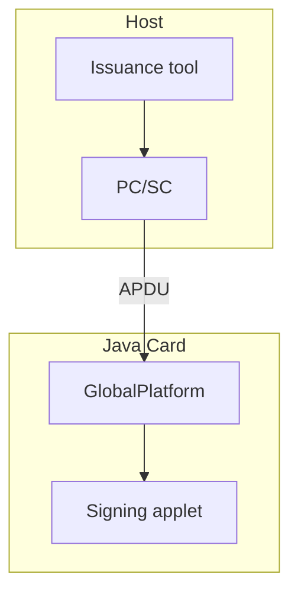
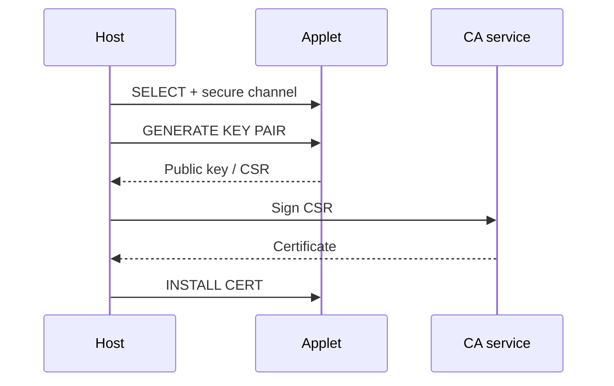
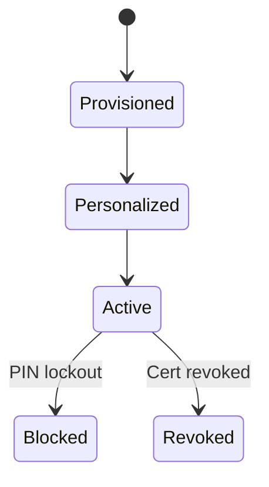

# Java Card Applets

**Smart-card** credentials and on-card cryptography — portfolio reference.

## What this project covers

| Topic | Detail |
|-------|--------|
| Applet | RSA/ECDSA on-card operations |
| Lifecycle | GlobalPlatform 2.x install / personalize |
| Host | PC/SC issuance and signing ceremonies |
| Security | PIN gate, non-exportable private keys |

## Architecture — component view

## Issuance ceremony sequence

## Lifecycle states

## Complex use case

**Scenario:** High-assurance users receive cards for qualified signing; host drives ceremony; keys never leave chip.

Full narrative: [docs/use-cases/05-java-card-issuance.md](../docs/use-cases/05-java-card-issuance.md)

Extended diagrams: [docs/diagrams/07-java-card-applet-lifecycle.md](../docs/diagrams/07-java-card-applet-lifecycle.md)

## Related code samples

| Project | Relation |
|---------|----------|
| [PKI Server](../pki-server/) | Issues certificates after CSR |
| [PKCS#11 HSM Service](../pkcs11-hsm-service/) | Server-side HSM signing contrast |

> Applet bytecode is proprietary; documentation supports **interview and design** discussions.
