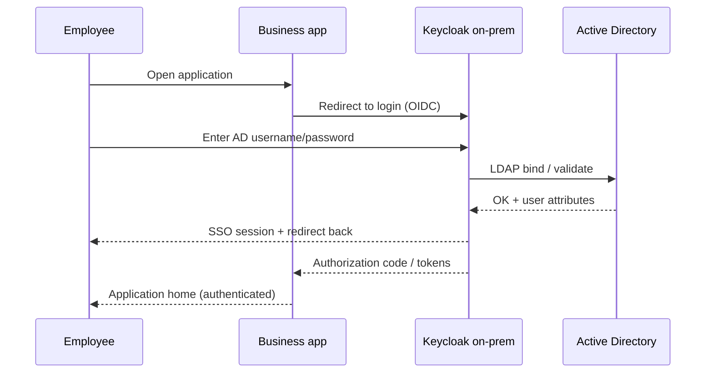

# Client use case: on-prem IAM with directory & SSO

## Requirement (typical SMB / integrator project)

A company already uses **Active Directory** for staff accounts. Internal web applications each have their own login. They want:

1. **On-prem identity server** (Keycloak) — data stays in their network  
2. **AD integration** — no duplicate user database  
3. **Single sign-on (OIDC)** — one login for multiple apps  
4. **Documentation** and optional ongoing support  

## Solution pattern

## Runnable demonstration

| Asset | Link |
|-------|------|
| Local demo | [README — Quick start](./README.md#quick-start-windows) |
| Presenter script | [DEMO-WALKTHROUGH.md](./DEMO-WALKTHROUGH.md) |
| Compose stack | [docker-compose.yml](./docker-compose.yml) |

## Production vs demo

| Component | Demo | Production |
|-----------|------|------------|
| Directory | OpenLDAP | Microsoft Active Directory |
| Keycloak | Dev mode, HTTP | Hardened, HTTPS, backups |
| Apps | Two HTML portals | Client Spring / .NET / etc. |
| Scale | 2 users | Full employee population |

## Related portfolio material

- [Keycloak SPI sample](../keycloak-pki-authenticator/) — advanced login extensions  
- [Signing platform architecture](../signing-platform-architecture/) — full enterprise context  

MIT — demonstration only; no client data.
