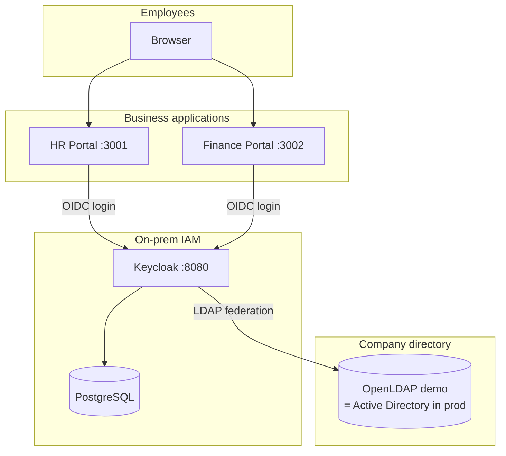

# Keycloak + Active Directory + application SSO — client demo

Runnable lab that mirrors a **typical integrator client ask**:

> On-prem Keycloak · directory (Active Directory) for users · MFA · OIDC/SAML single sign-on across internal applications.

**OpenLDAP in this demo = stand-in for Active Directory.** Keycloak uses the same **LDAP user federation** settings in production; only the connection URL, bind DN, and attribute names change.

## Start the demo (one command)

```powershell
cd keycloak-ad-sso-demo
powershell -ExecutionPolicy Bypass -File setup/start-demo.ps1
```

**Detailed guide:** **[DEMO-SETUP-GUIDE.md](./DEMO-SETUP-GUIDE.md)** — prerequisites, configuration, presentation, troubleshooting.

## What you can show the client (10 minutes)

| Step | Show |
|------|------|
| 1 | **Application launcher** (:3000) — employee hub for 8 apps |
| 2 | Login at **Keycloak** with directory password (`ahmed` / `Demo@123`) |
| 3 | Open **HR Portal** — OIDC token claims |
| 4 | Open **Finance Portal** — **already signed in** (SSO) |
| 5 | Admin console — LDAP federation, 8 registered clients, MFA policy |
| 6 | **Integration packs** — automated output per app for vendor teams |

Presenter script: **[DEMO-WALKTHROUGH.md](./DEMO-WALKTHROUGH.md)**

**Detailed PDF guide (AD + OIDC flows):** [docs/IAM-OIDC-AD-Flow.pdf](./docs/IAM-OIDC-AD-Flow.pdf)  

**Customer proposal (professional PDF with diagrams):** [docs/SecureLink-Customer-Implementation-Proposal.pdf](./docs/SecureLink-Customer-Implementation-Proposal.pdf) — edit [docs/proposal/securelink-proposal.html](./docs/proposal/securelink-proposal.html) then run `python scripts/generate_proposal_pdf.py`

## Architecture



## Quick start (Windows)

```powershell
cd keycloak-ad-sso-demo
powershell -ExecutionPolicy Bypass -File setup/start-demo.ps1
```

Or manually:

```powershell
docker compose up -d
powershell -File setup/configure-ldap.ps1
powershell -File setup/register-clients-from-intake.ps1
```

Open:

| URL | Purpose |
|-----|---------|
| http://localhost:3000 | **Application launcher** (start here — 8 apps) |
| http://localhost:3001 | HR Portal (OIDC demo) |
| http://localhost:3002 | Finance Portal (SSO) |
| http://localhost:8080 | Keycloak admin (`admin` / `admin`) |

**Demo users** (directory):

| Username | Password | Groups |
|----------|----------|--------|
| `ahmed` | `Demo@123` | employees |
| `sara` | `Demo@123` | employees, hr-team |

## Map demo → client production

| Demo | Client production |
|------|-------------------|
| OpenLDAP container | **Active Directory** domain controller |
| `ldap://openldap:389` | `ldap://dc.company.local:389` or **LDAPS :636** |
| `cn=admin,dc=company,dc=local` | Service account `CN=kc-bind,OU=Service Accounts,...` |
| `uid` / `inetOrgPerson` | `sAMAccountName` / `user` object classes |
| HR + Finance HTML apps | Client’s real web apps (Spring, .NET, etc.) |
| `start-dev` Keycloak | Hardened on-prem install + TLS + backups |

## Deliverables this demo represents

- Keycloak on infrastructure with PostgreSQL  
- Directory federation (users + groups)  
- OIDC client per application  
- SSO session across apps  
- Admin console + sync + handover documentation  

## Files

```
keycloak-ad-sso-demo/
  DEMO-SETUP-GUIDE.md     # Full setup & presentation guide
  docker-compose.yml      # Keycloak, Postgres, LDAP, demo apps
  setup/start-demo.ps1    # One-command startup
  setup/apps-intake.example.json
  integration-packs/      # Generated SSO packs per app
  ldap/bootstrap.ldif     # Demo employees & groups
  keycloak/import/        # Realm bootstrap
  demo-apps/              # Launcher + HR & Finance portals
  setup/configure-ldap.*  # Attach LDAP federation + sync users
  DEMO-WALKTHROUGH.md     # Call / presentation script
  PROJECT.md              # Client-facing summary
```

MIT — portfolio demonstration only.
