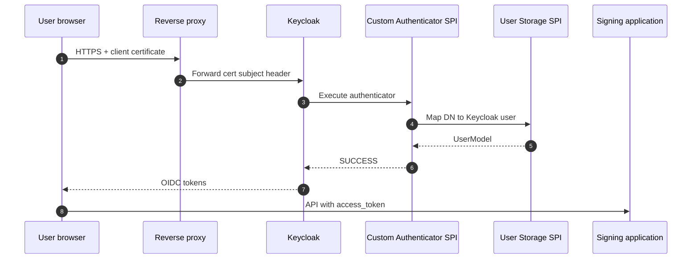

# Keycloak IAM Integration — project documentation

> Portfolio sample aligned with production **Keycloak + PKI** work at Dictalabs.

## Overview

Centralized **OIDC/SSO** with **custom SPI** providers so enterprise users authenticate with certificate-aware policies while signing services receive consistent JWT claims (`tenant_id`, signing roles).

## Architecture diagram

## Complex use case

**Problem:** Multiple signing microservices each implemented custom certificate login.

**Approach:** Realms per tenant; Authenticator + User Storage + Protocol Mapper SPIs; remove duplicated auth logic from services.

**Outcome:** Single IAM layer, auditable login, claims for downstream CSC/PKI APIs.

Full narrative: [docs/use-cases/02-keycloak-pki-authentication.md](../docs/use-cases/02-keycloak-pki-authentication.md)

## Runnable demo

| Step | Link |
|------|------|
| Build SPI JAR | [README — Build](./README.md#build) |
| Docker Keycloak 24 | [demo/README.md](./demo/README.md) |
| Configure realm + test header | [demo/README.md](./demo/README.md#4-simulate-certificate-header) |

## Source code

| Path | Description |
|------|-------------|
| `src/main/java/.../CertificateSubjectAuthenticator.java` | Demo authenticator |
| `src/main/java/.../CertificateSubjectAuthenticatorFactory.java` | SPI registration |
| `pom.xml` | Keycloak 24 SPI dependencies |

## SPI types in production (reference)

| SPI | Role |
|-----|------|
| Authenticator | Certificate / policy gate at login |
| User Storage | Map X.509 identity to realm user |
| Protocol Mapper | Attach signing claims to JWT |
| Event Listener | Compliance audit events |
