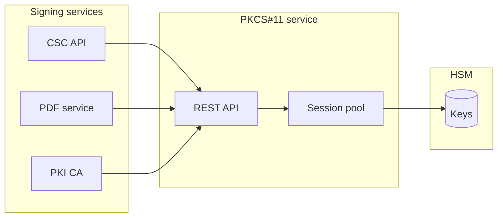
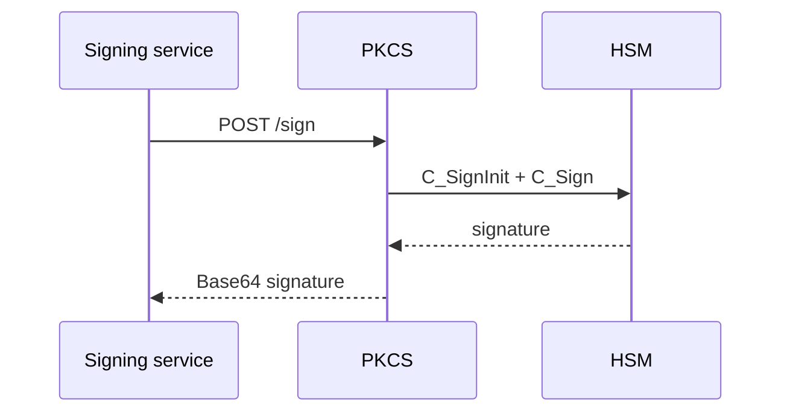

# PKCS#11 HSM Service

**REST abstraction** over enterprise HSMs (AWS CloudHSM, Utimaco, SoftHSM2) — portfolio reference.

## What this project covers

| Feature | Description |
|---------|-------------|
| Session pooling | Reuse PKCS#11 sessions under load |
| Multi-vendor | Pluggable backends |
| RBAC | Tenant + key-label authorization |
| Observability | Structured errors for on-call |

## Architecture

## Complex use case — reliability at scale

**Problem:** Intermittent `CKR_DEVICE_ERROR` and session exhaustion during peak signing.

**Approach:** Pooled sessions, idempotent sign requests, circuit breaker to HSM, Redis coordination for long operations.

**Outcome:** Stable CSC and PDF pipelines; faster incident triage.

Related: [docs/use-cases/03-pdf-workflow-hsm-signing.md](../docs/use-cases/03-pdf-workflow-hsm-signing.md)

## Diagrams

- [HSM / PKCS#11 detail](../docs/diagrams/04-hsm-pkcs11-signing.md)
- [CSC sequence](../docs/diagrams/02-csc-remote-signing-sequence.md)

## Runnable samples

| Sample | Link |
|--------|------|
| CSC mock (uses logical HSM) | [csc-mock-server](../csc-mock-server/) |

> PKCS#11 service implementation is proprietary; diagrams and flows here support architecture reviews.
