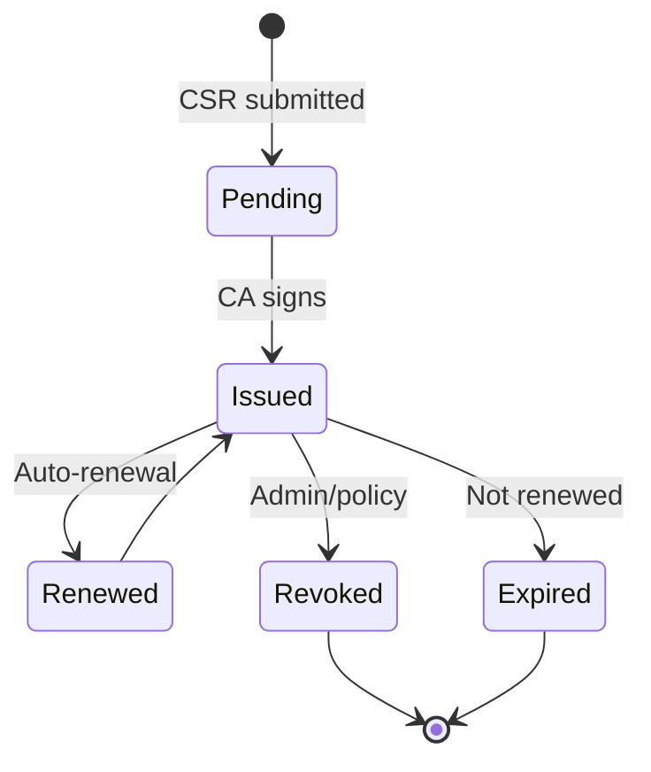
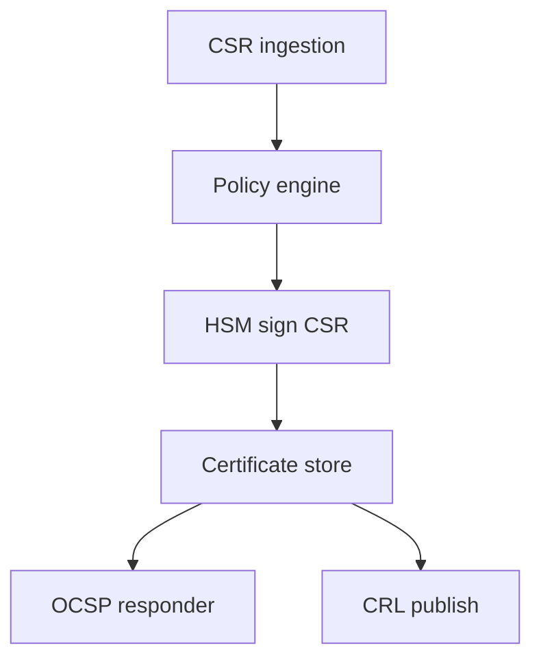

# PKI Server

Production-style **Certificate Authority** and lifecycle platform — portfolio reference (sanitized).

## What this project covers

| Capability | Description |
|------------|-------------|
| Issuance | CSR validation, policy engine, HSM-backed signing |
| Lifecycle | Renewal windows, revocation, tenant-scoped profiles |
| Revocation | OCSP responder + CRL distribution |
| Operations | Audit trail per certificate event |

## Architecture — PKI lifecycle

## Complex use case — multi-tenant CA

**Problem:** One operator hosts PKI for many enterprises with isolated policies.

**Approach:** Tenant-scoped profiles, HSM key labels per tenant, JWT `tenant_id` on CA API, partitioned renewal jobs.

**Outcome:** Isolated issuance and revocation without cross-tenant leakage.

Full write-up: [docs/use-cases/04-multi-tenant-pki.md](../docs/use-cases/04-multi-tenant-pki.md)

## Integration points

| System | Integration |
|--------|-------------|
| PKCS#11 service | CA signing keys in HSM |
| CSC / signing apps | End-entity certs for remote signing |
| Keycloak | Optional cert auth for admin console |

## Related diagrams

- [Platform overview](../docs/diagrams/01-platform-overview.md)
- [PKI lifecycle (extended)](../docs/diagrams/05-pki-lifecycle.md)

## Code samples in this monorepo

Implementation samples live in related projects:

- [PKCS#11 HSM Service](../pkcs11-hsm-service/)
- [Keycloak IAM](../keycloak-pki-authenticator/)

> CA application source is proprietary in production; this project documents **architecture and operations** for interviews.
