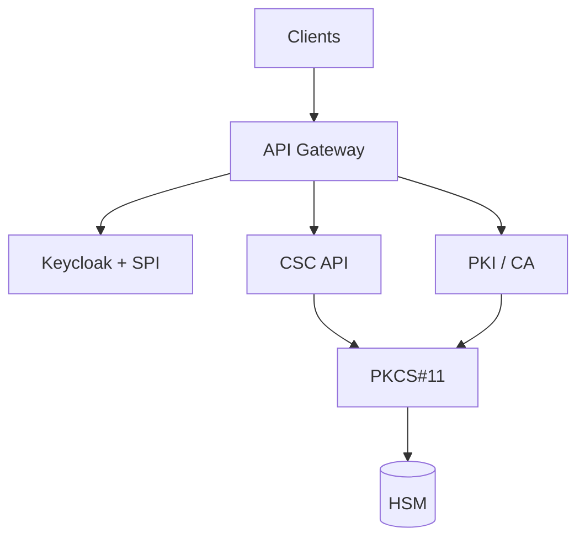

# Signing & Trust Platform Architecture

Entry point for platform architecture. **Full diagram set** lives under [docs/diagrams/](../docs/diagrams/).

## Quick view

## Deep dives

| Topic | Document |
|-------|----------|
| Full platform map | [01-platform-overview.md](../docs/diagrams/01-platform-overview.md) |
| CSC remote signing | [02-csc-remote-signing-sequence.md](../docs/diagrams/02-csc-remote-signing-sequence.md) |
| Production deployment | [06-deployment-topology.md](../docs/diagrams/06-deployment-topology.md) |
| All use cases | [docs/use-cases/](../docs/use-cases/) |

## Related code samples

- [Keycloak SPI](../keycloak-pki-authenticator/)
- [CSC OpenAPI](../csc-remote-signing-openapi/)
