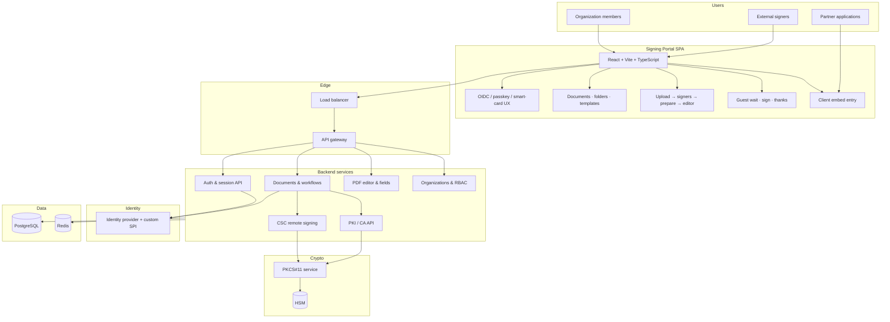
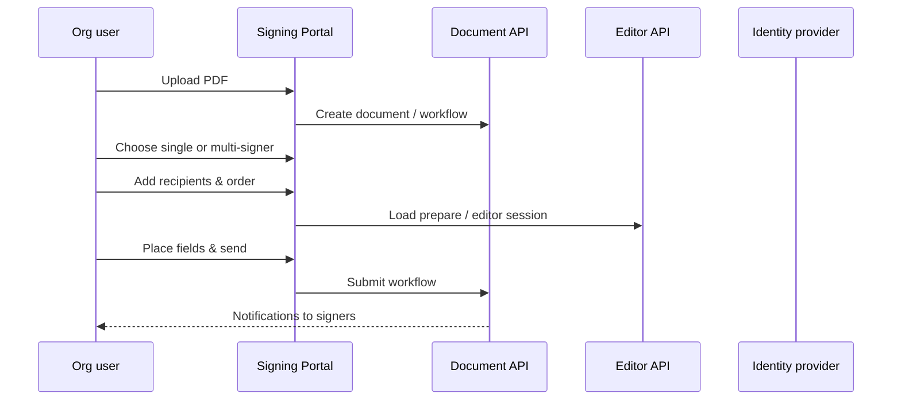
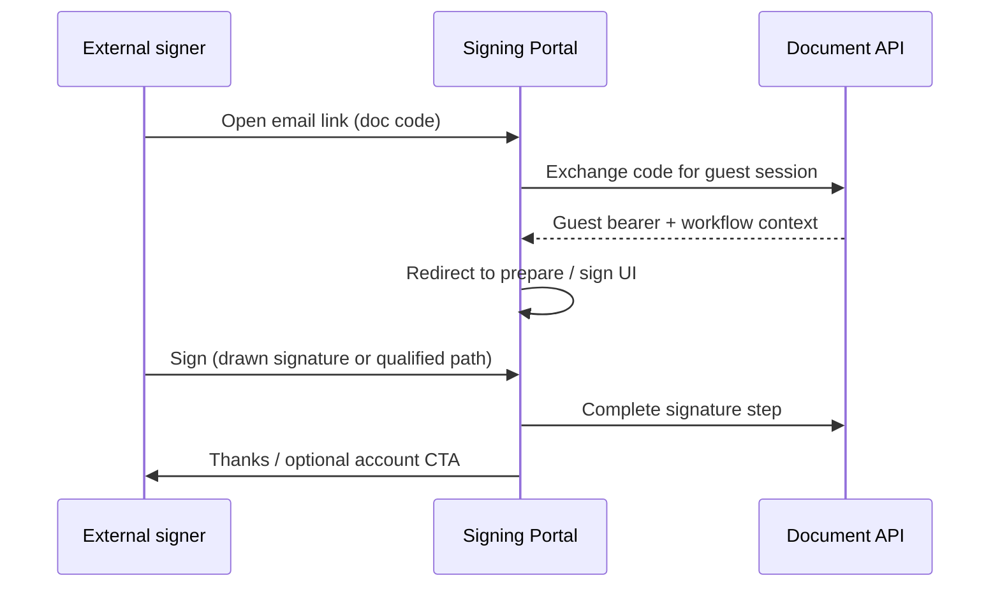
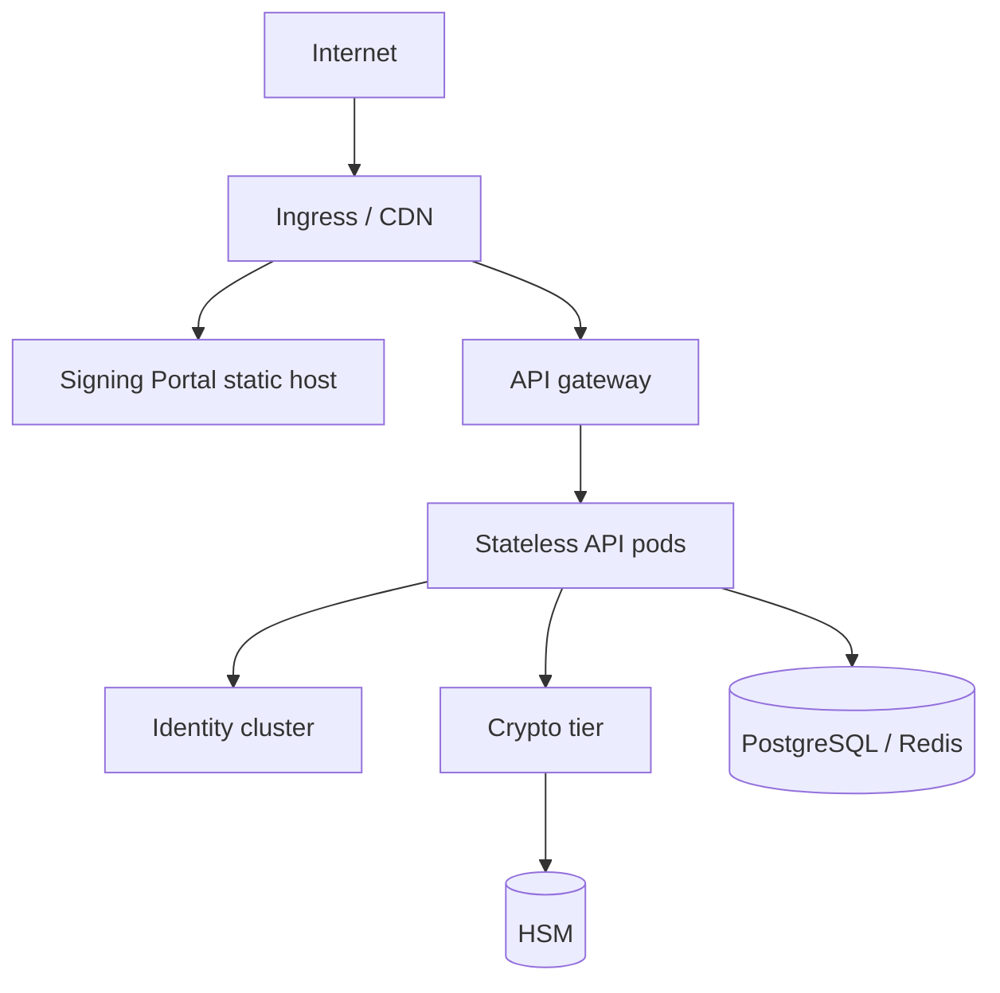

# Signing Platform (full stack)

End-to-end **digital trust platform**: a multi-tenant **Signing Portal** (React SPA), identity plane, document workflow APIs, CSC remote signing, PKI, and HSM-backed cryptography.

> Architecture below is derived from a production signing workspace UI (routes, modules, API boundaries). All product and company names are **generic** portfolio labels.

## System context

## Signing Portal — functional areas

| Area | Purpose |
|------|---------|
| **Home & dashboard** | Activity summary after login |
| **Documents & folders** | Library, move/rename, download options |
| **Templates** | Reusable layouts (RBAC-gated module) |
| **Upload & workflow** | PDF upload, single vs multi-signer choice, recipient list |
| **Prepare & editor** | Place signature/date/text fields on PDF pages |
| **Send & track** | Workflow status, void, password-protected docs |
| **Guest signing** | Email link → wait/exchange code → sign without full account |
| **Signer link** | Public `/sign/:code` route for invited recipients |
| **Settings** | Account, security, signature appearance, notifications |
| **Organization admin** | Users, roles, branding, billing, business apps, org profile |
| **Integrations** | iframe/embed entry via client token + workflow id |
| **Trust methods** | CSC OAuth popup callback, smart-card popup, WebAuthn passkey enrollment |

## Document send flow (authenticated)

## Guest signer flow

## Qualified / remote signing (CSC)

When policy requires **advanced** or **qualified** signatures, the editor opens an OAuth popup to a **CSC-compatible provider**. The portal hosts a dedicated **redirect callback route** that returns the authorization code to the opener via same-origin storage (popup-safe pattern).

See [CSC Remote Signing](../csc-remote-signing-openapi/) and [diagram 02](../docs/diagrams/02-csc-remote-signing-sequence.md).

## Frontend ↔ API map (sanitized)

| Portal concern | Backend service boundary |
|----------------|-------------------------|
| Login, refresh, OTT callback | Auth API |
| Branding, feature flags | App settings API |
| Document list, void, guest token | Documents API |
| Field placement, page render | Editor API |
| Folders | Folders API |
| Templates CRUD | Templates API |
| Org users, roles, quotas | Organization API |
| Signer session (public link) | Signer API |
| Passkey enroll action | Passkey enrollment API |
| User preferences | User settings API |

## Signature policy (tenant RBAC)

Roles can cap which signature **levels** are allowed (electronic, advanced, qualified), whether users may **send** or only **request** signatures, template usage, and per-level **quotas**. Organization owners bypass restrictions for operational safety.

## Deployment topology

## Deeper reading

| Topic | Link |
|-------|------|
| Portal user journeys (diagrams) | [docs/diagrams/08-signing-portal-flows.md](../docs/diagrams/08-signing-portal-flows.md) |
| Document workspace use case | [docs/use-cases/06-document-signing-workspace.md](../docs/use-cases/06-document-signing-workspace.md) |
| Platform overview | [docs/diagrams/01-platform-overview.md](../docs/diagrams/01-platform-overview.md) |
| All use cases | [docs/use-cases/](../docs/use-cases/) |

## Sample projects in this repo

| Capability | Folder |
|------------|--------|
| Keycloak IAM | [keycloak-pki-authenticator](../keycloak-pki-authenticator/) |
| CSC remote signing | [csc-remote-signing-openapi](../csc-remote-signing-openapi/) |
| PKI Server | [pki-server](../pki-server/) |
| PKCS#11 HSM | [pkcs11-hsm-service](../pkcs11-hsm-service/) |
| Java Card | [java-card-applets](../java-card-applets/) |

MIT — portfolio reference only.
