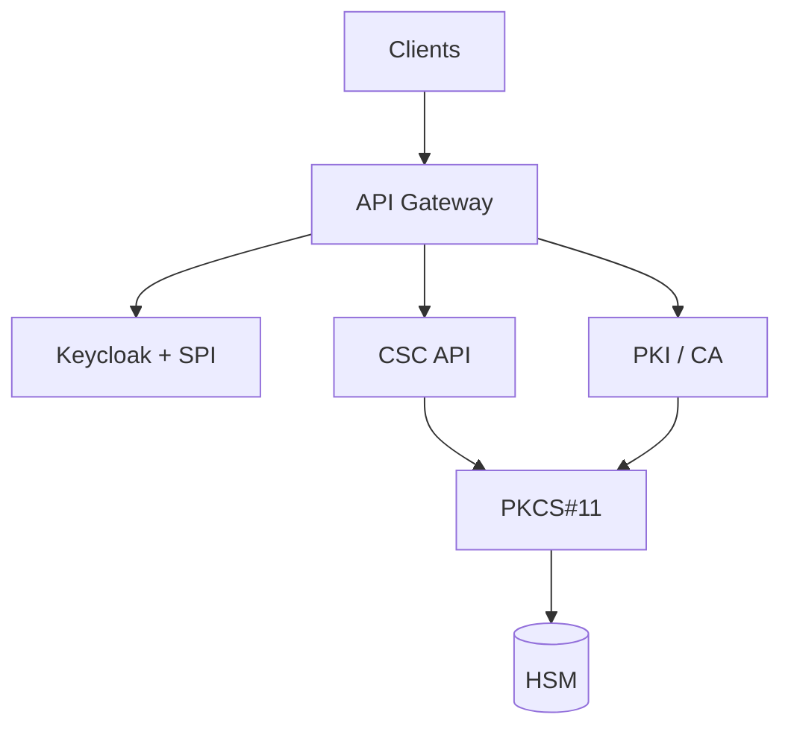
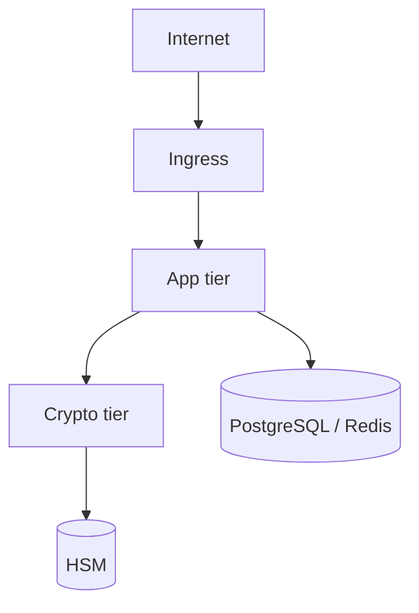

# Signing Platform (full stack)

End-to-end **digital trust platform** — how PKI, CSC, Keycloak, HSM, and data services fit together.

## Platform diagram

## Deployment topology

Full diagram set: [docs/diagrams/](../docs/diagrams/)

## Projects in this monorepo

| Project | GitHub folder |
|---------|---------------|
| Keycloak IAM | [keycloak-pki-authenticator](../keycloak-pki-authenticator/) |
| CSC remote signing | [csc-remote-signing-openapi](../csc-remote-signing-openapi/) |
| PKI Server | [pki-server](../pki-server/) |
| PKCS#11 HSM | [pkcs11-hsm-service](../pkcs11-hsm-service/) |
| Java Card | [java-card-applets](../java-card-applets/) |

## Use cases (all scenarios)

[docs/use-cases/](../docs/use-cases/)

MIT — portfolio reference.
